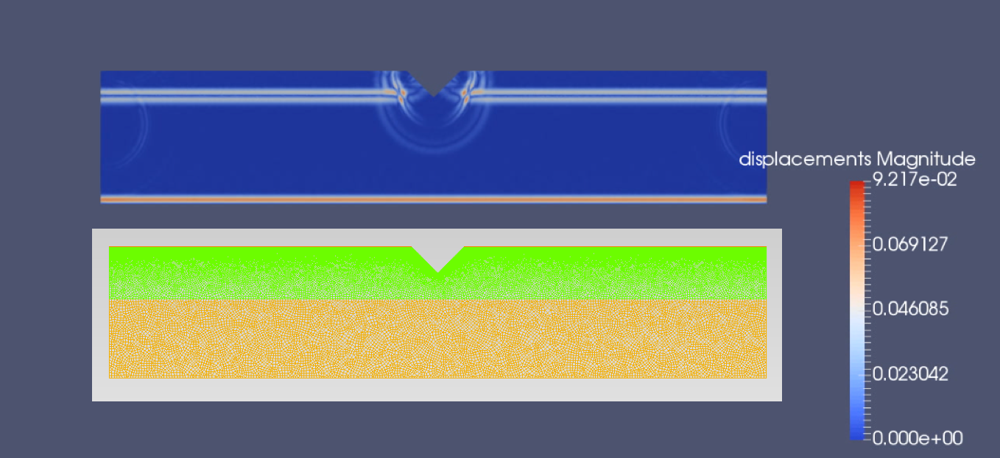

# SolidsPy: 2D-Finite Element Analysis with Python




This _repo_ contains the dynamic version of the finite element analysis code [SOLIDSPy](https://github.com/AppliedMechanics-EAFIT/SolidsPy).
The dynamic code uses an implicit time integrator scheme.

## Features
The code allows the user to find the displacement time histories for all the points in the mesh. The response is written into ready to process Paraview VTKs files.

The _repo_ contains 5 main folders:

1. `solidspydyn/` which stores the source code in the following modules:

    - `solids_GUI.py`: The main program;
    - `preprocesor.py`: Pre-processing subroutines including [Gmsh](http://gmsh.info/) convertion functions using [`meshio`](https://github.com/nschloe/meshio)
    - `assemutil.py`: Assembly of elemental stiffness matrices ;
    - `femutil.py`: Shape functions, its derivatives and general finite element method subroutines;
    - `uelutil.py`: Elemental or local matrix subroutines for different elements; and
    - `postprocesor.py`: Several results handling subroutines.

2. `meshes/` Complete models including its Gmsh representation and a Python script to produce the required
    (nodes, elements, materials and load) text files ready for input.

3. `docs/` Documentation files in the form of easy-to-follow tutorials
     showing how to define a SolidsPy model in terms of text files and model
     creation with [Gmsh](http://gmsh.info/).

## Installation
The code is written in Python and it depends on `numpy`, `scipy` and `sympy`.

To install _SolidsPy_ open a terminal and type:

    pip install solidspy

To run the examples with specification of the folder stoing the input files through a GUI you will need to install
[`easygui`](http://easygui.readthedocs.org/en/master/).

To easily generate the required SolidsPy text files out of a [Gmsh](http://gmsh.info/) model
you will need [`meshio`](https://github.com/nschloe/meshio).

These two can be installed with:

    pip install easygui
    pip install meshio

## How to run a simple model
After installation, you can run an analysis in 3 easy steps (see [template](./docs/template/README.md)):
- Create the model (i.e., geometry and mesh) using [Gmsh](http://gmsh.info/). Several meshes are available in the repo [`SOLIDSPy-meshes`](https://github.com/AppliedMechanics-EAFIT/SolidsPy-meshes)
- Generate the text files (eles.txt, nodes.txt, mater.txt and loads.txt) required by _SolidsPy_ using
  a python script based on [`meshio`](https://github.com/nschloe/meshio).
- Run it in Python as follows:

```python
import matplotlib.pyplot as plt  # load matplotlib
from solidspy import solids_GUI  # import our package
disp = solids_GUI()  # run the Finite Element Analysis
plt.show()    # plot contours
```

This would not work properly in Anaconda for Mac OS. In that case is suggested to use an IPython console to run the example.

## License
This project is licensed under the
[MIT license](http://en.wikipedia.org/wiki/MIT_License). The documents are
licensed under

[Creative Commons Attribution License](http://creativecommons.org/licenses/by/4.0/).

## Authors
- [Juan Gomez](http://www.eafit.edu.co/docentes-investigadores/Paginas/juan-gomez.aspx),
    Professor at Universidad EAFIT.
- [Nicolás Guarín-Zapata](https://github.com/nicoguaro), Researcher at the Applied Mechanics Group
    at Universidad EAFIT.
